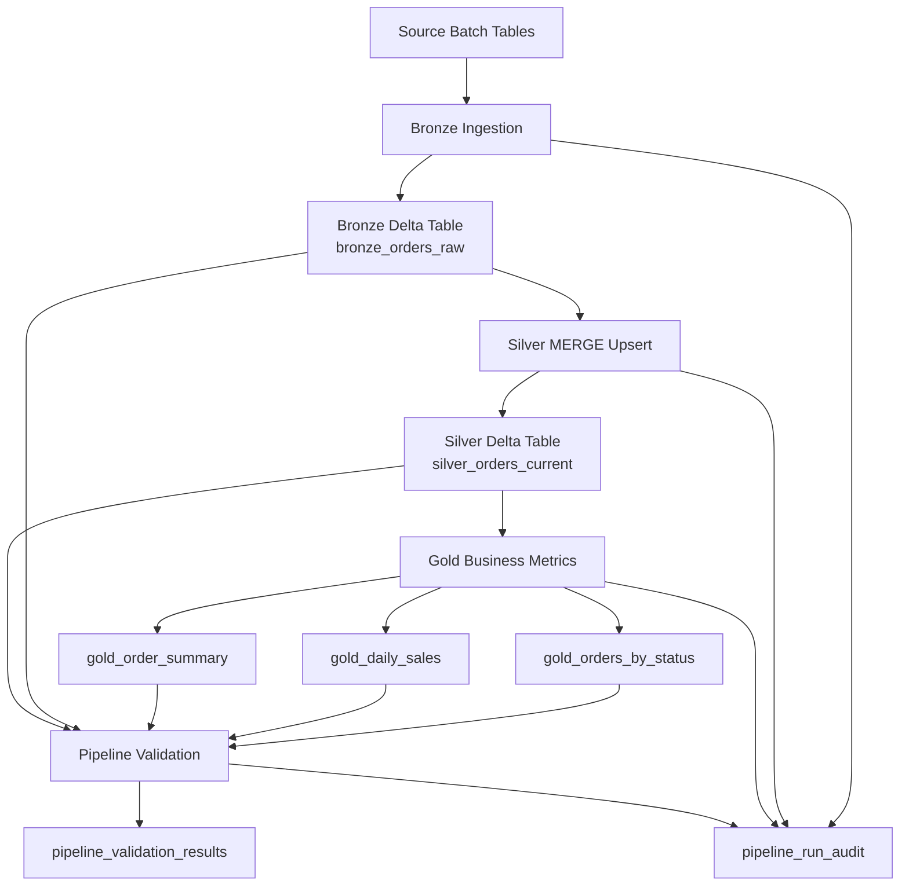
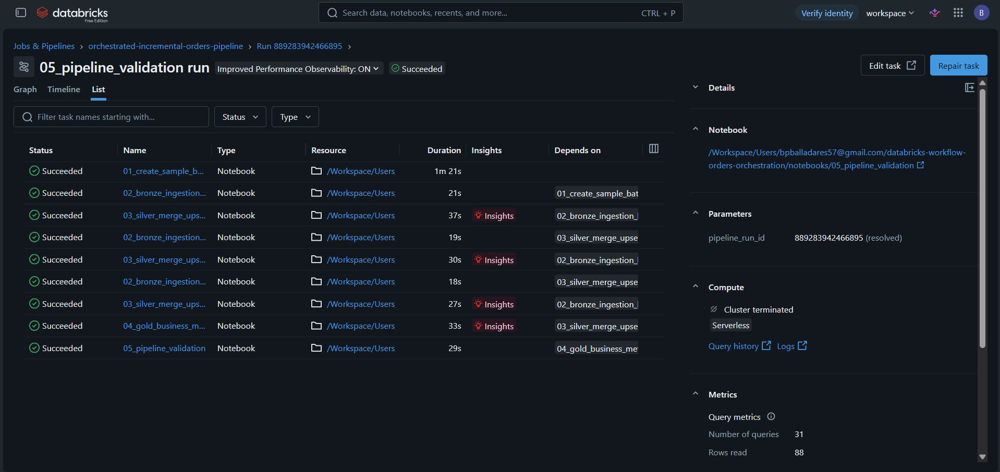
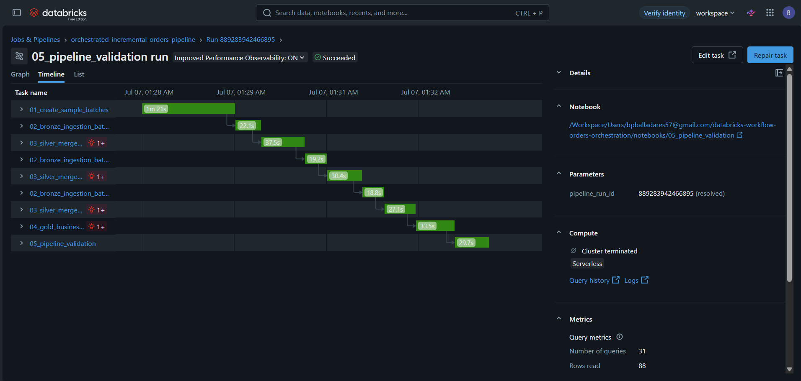
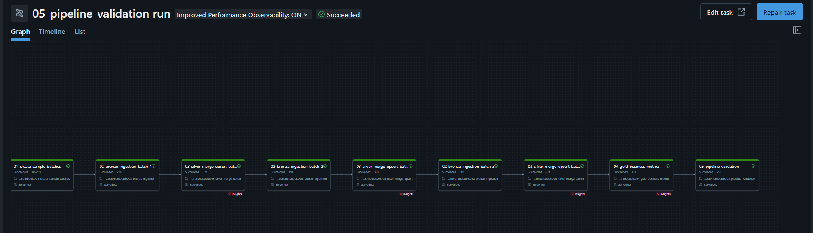
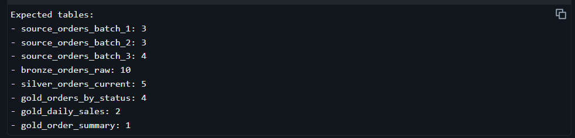
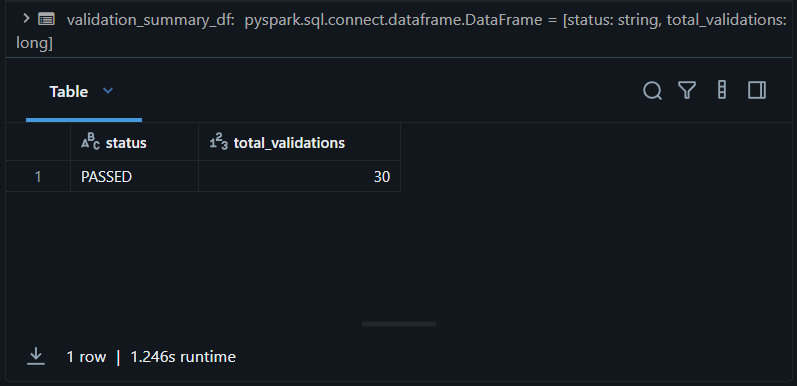
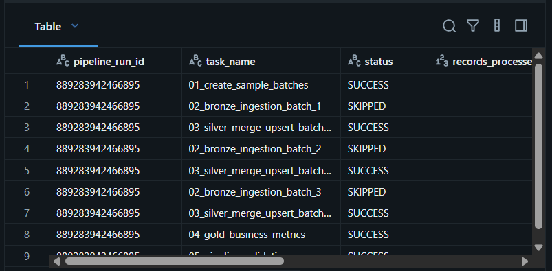

# Orchestrated Incremental Orders Pipeline with Databricks Workflows

## Overview

This project implements an orchestrated incremental data pipeline using **Databricks Workflows**, **Apache Spark**, **PySpark**, **Spark SQL**, and **Delta Lake**.

The pipeline simulates an e-commerce order processing system where order events arrive in multiple batches. Each batch may contain new orders or updates to existing orders. The solution processes these batches through a Medallion-style architecture and maintains a reliable current-state orders table using Delta Lake `MERGE INTO`.

The project also includes workflow orchestration, task dependencies, notebook parameters, audit logging, and automated validation to verify that the pipeline completed successfully.

---

## Objectives

The main objectives of this project are:

* Build an end-to-end incremental data pipeline in Databricks.
* Orchestrate multiple notebooks using Databricks Workflows.
* Process order events in batch sequence.
* Store all raw order events in a Bronze Delta table.
* Maintain a Silver current-state table using Delta Lake `MERGE INTO`.
* Generate Gold business metrics from the current-state table.
* Track pipeline execution through an audit table.
* Validate the final pipeline state using automated checks.

---

## Architecture



---

## Pipeline Flow

The workflow executes the pipeline in the following order:

```text
01_create_sample_batches
        ↓
02_bronze_ingestion_batch_1
        ↓
03_silver_merge_upsert_batch_1
        ↓
02_bronze_ingestion_batch_2
        ↓
03_silver_merge_upsert_batch_2
        ↓
02_bronze_ingestion_batch_3
        ↓
03_silver_merge_upsert_batch_3
        ↓
04_gold_business_metrics
        ↓
05_pipeline_validation
```

This design ensures that each batch is processed incrementally through Bronze and Silver before the Gold metrics are generated.

---

## Technology Stack

* Databricks Free Edition
* Databricks Workflows
* Apache Spark
* PySpark
* Spark SQL
* Delta Lake
* Delta Lake `MERGE INTO`
* GitHub
* Databricks Git Folders

---

## Repository Structure

```text
databricks-workflow-orders-orchestration/
│
├── README.md
│
├── notebooks/
│   ├── 01_create_sample_batches.ipynb
│   ├── 02_bronze_ingestion.ipynb
│   ├── 03_silver_merge_upsert.ipynb
│   ├── 04_gold_business_metrics.ipynb
│   └── 05_pipeline_validation.ipynb
│
├── images/
│   ├── workflow_success_list.png
│   ├── workflow_timeline.png
│   ├── workflow_graph.png
│   ├── validation_results.png
│   ├── pipeline_audit.png
│   └── table_counts.png
│
└── docs/
    └── architecture.md
```

---

## Project Schema

All project tables are created inside the following schema:

```text
orders_workflow_project
```

Using a dedicated schema keeps all project assets isolated and organized.

---

## Source Data

The project uses synthetic source batches to simulate incremental order events from an e-commerce system.

### Source Batch Tables

```text
orders_workflow_project.source_orders_batch_1
orders_workflow_project.source_orders_batch_2
orders_workflow_project.source_orders_batch_3
```

Each record represents an order event.

| Column          | Description                            |
| --------------- | -------------------------------------- |
| `batch_id`      | Identifier of the source batch         |
| `order_id`      | Unique order identifier                |
| `customer_id`   | Unique customer identifier             |
| `order_status`  | Order status at the time of the event  |
| `order_amount`  | Order amount in USD                    |
| `event_ts`      | Timestamp when the event occurred      |
| `source_system` | Source system that generated the event |

---

## Order Lifecycle

The source data simulates order status changes over time.

Example:

```text
1001 → pending
1001 → shipped
1001 → delivered
```

The pipeline must preserve the complete event history while also maintaining the latest status of each order.

---

## Medallion Architecture

This project uses a Medallion-style architecture:

```text
Bronze → Silver → Gold
```

Each layer has a clear responsibility.

---

## Bronze Layer

### Table

```text
orders_workflow_project.bronze_orders_raw
```

### Purpose

The Bronze layer stores all incoming order events exactly as they arrive from the source batch tables.

This layer is append-based and keeps the complete historical event log.

### Responsibilities

* Read one source batch at a time.
* Add ingestion metadata.
* Append raw events into a Delta table.
* Preserve historical order status changes.
* Prevent duplicate ingestion of the same batch.

### Key Columns

| Column                | Description                                     |
| --------------------- | ----------------------------------------------- |
| `batch_id`            | Source batch identifier                         |
| `order_id`            | Order identifier                                |
| `customer_id`         | Customer identifier                             |
| `order_status`        | Status received from the source event           |
| `order_amount`        | Order amount                                    |
| `event_ts`            | Source event timestamp                          |
| `source_system`       | Source system name                              |
| `bronze_ingestion_ts` | Timestamp when the event was loaded into Bronze |
| `source_batch_table`  | Name of the source batch table                  |

---

## Silver Layer

### Table

```text
orders_workflow_project.silver_orders_current
```

### Purpose

The Silver layer maintains the latest known state of each order.

Unlike Bronze, Silver stores one row per `order_id`. It uses Delta Lake `MERGE INTO` to update existing orders or insert new orders as new batches are processed.

### Responsibilities

* Read one Bronze batch at a time.
* Deduplicate records within the batch by `order_id`.
* Select the latest event using `event_ts`.
* Update existing orders when a newer event arrives.
* Insert new orders when they do not exist in Silver.
* Prevent older events from overwriting newer records.

### Delta Lake MERGE Pattern

```sql
MERGE INTO orders_workflow_project.silver_orders_current AS target
USING silver_updates_temp AS source
ON target.order_id = source.order_id

WHEN MATCHED AND source.last_event_ts > target.last_event_ts THEN
  UPDATE SET
    target.customer_id = source.customer_id,
    target.order_status = source.order_status,
    target.order_amount = source.order_amount,
    target.last_event_ts = source.last_event_ts,
    target.last_batch_id = source.last_batch_id,
    target.source_system = source.source_system,
    target.source_batch_table = source.source_batch_table,
    target.bronze_ingestion_ts = source.bronze_ingestion_ts,
    target.silver_processed_ts = source.silver_processed_ts

WHEN NOT MATCHED THEN
  INSERT (
    order_id,
    customer_id,
    order_status,
    order_amount,
    last_event_ts,
    last_batch_id,
    source_system,
    source_batch_table,
    bronze_ingestion_ts,
    silver_processed_ts
  )
  VALUES (
    source.order_id,
    source.customer_id,
    source.order_status,
    source.order_amount,
    source.last_event_ts,
    source.last_batch_id,
    source.source_system,
    source.source_batch_table,
    source.bronze_ingestion_ts,
    source.silver_processed_ts
  )
```

---

## Gold Layer

The Gold layer creates business-ready analytical tables from the Silver current-state table.

### Gold Tables

```text
orders_workflow_project.gold_orders_by_status
orders_workflow_project.gold_daily_sales
orders_workflow_project.gold_order_summary
```

---

### `gold_orders_by_status`

Aggregates current orders by status.

| Metric                 | Description                                 |
| ---------------------- | ------------------------------------------- |
| `order_status`         | Current status of the order                 |
| `total_orders`         | Number of orders in that status             |
| `total_amount_usd`     | Total order amount by status                |
| `avg_order_amount_usd` | Average order amount by status              |
| `first_event_ts`       | Earliest event timestamp in the group       |
| `latest_event_ts`      | Latest event timestamp in the group         |
| `gold_processed_ts`    | Timestamp when the Gold table was processed |

---

### `gold_daily_sales`

Aggregates current orders by the date of their latest activity.

| Metric                           | Description                             |
| -------------------------------- | --------------------------------------- |
| `order_activity_date`            | Date of latest order activity           |
| `total_current_orders`           | Number of current orders for that date  |
| `gross_current_order_amount_usd` | Gross current order amount              |
| `recognized_revenue_usd`         | Revenue from delivered orders           |
| `cancelled_amount_usd`           | Amount associated with cancelled orders |
| `pending_orders`                 | Count of pending orders                 |
| `shipped_orders`                 | Count of shipped orders                 |
| `delivered_orders`               | Count of delivered orders               |
| `cancelled_orders`               | Count of cancelled orders               |

---

### `gold_order_summary`

Provides a one-row executive summary of the current order state.

| Metric                           | Description                       |
| -------------------------------- | --------------------------------- |
| `total_current_orders`           | Total number of current orders    |
| `total_customers`                | Total number of unique customers  |
| `gross_current_order_amount_usd` | Gross value of all current orders |
| `recognized_revenue_usd`         | Revenue from delivered orders     |
| `active_order_amount_usd`        | Value of non-cancelled orders     |
| `cancelled_amount_usd`           | Value of cancelled orders         |
| `pending_orders`                 | Number of pending orders          |
| `shipped_orders`                 | Number of shipped orders          |
| `delivered_orders`               | Number of delivered orders        |
| `cancelled_orders`               | Number of cancelled orders        |
| `avg_order_value_usd`            | Average order value               |
| `delivered_rate_pct`             | Percentage of delivered orders    |
| `cancellation_rate_pct`          | Percentage of cancelled orders    |

---

## Workflow Orchestration

The pipeline is orchestrated using Databricks Workflows.

### Job Name

```text
orchestrated-incremental-orders-pipeline
```

### Job Parameter

The workflow uses a global job parameter:

```text
pipeline_run_id = {{job.run_id}}
```

This value is passed to all notebooks and used to track execution records in the audit and validation tables.

### Batch Parameters

The Bronze and Silver notebooks are parameterized with:

```text
batch_id
```

This allows the same notebook to be reused for batch 1, batch 2, and batch 3.

---

## Workflow Tasks

| Task                             | Notebook                   | Parameters                      | Dependency                       |
| -------------------------------- | -------------------------- | ------------------------------- | -------------------------------- |
| `01_create_sample_batches`       | `01_create_sample_batches` | `pipeline_run_id`               | None                             |
| `02_bronze_ingestion_batch_1`    | `02_bronze_ingestion`      | `pipeline_run_id`, `batch_id=1` | `01_create_sample_batches`       |
| `03_silver_merge_upsert_batch_1` | `03_silver_merge_upsert`   | `pipeline_run_id`, `batch_id=1` | `02_bronze_ingestion_batch_1`    |
| `02_bronze_ingestion_batch_2`    | `02_bronze_ingestion`      | `pipeline_run_id`, `batch_id=2` | `03_silver_merge_upsert_batch_1` |
| `03_silver_merge_upsert_batch_2` | `03_silver_merge_upsert`   | `pipeline_run_id`, `batch_id=2` | `02_bronze_ingestion_batch_2`    |
| `02_bronze_ingestion_batch_3`    | `02_bronze_ingestion`      | `pipeline_run_id`, `batch_id=3` | `03_silver_merge_upsert_batch_2` |
| `03_silver_merge_upsert_batch_3` | `03_silver_merge_upsert`   | `pipeline_run_id`, `batch_id=3` | `02_bronze_ingestion_batch_3`    |
| `04_gold_business_metrics`       | `04_gold_business_metrics` | `pipeline_run_id`               | `03_silver_merge_upsert_batch_3` |
| `05_pipeline_validation`         | `05_pipeline_validation`   | `pipeline_run_id`               | `04_gold_business_metrics`       |

---

## Audit Logging

### Table

```text
orders_workflow_project.pipeline_run_audit
```

The audit table records task execution details.

| Column              | Description                             |
| ------------------- | --------------------------------------- |
| `pipeline_run_id`   | Workflow run identifier                 |
| `task_name`         | Name of the executed task               |
| `status`            | Execution status                        |
| `records_processed` | Number of records processed by the task |
| `message`           | Execution message                       |
| `processed_ts`      | Processing timestamp                    |

Audit logging provides traceability across the full workflow execution.

---

## Pipeline Validation

### Table

```text
orders_workflow_project.pipeline_validation_results
```

The final notebook validates the pipeline output and stores validation results.

### Validation Checks

The validation notebook verifies:

* Expected tables exist.
* Source tables contain the expected number of records.
* Bronze contains 10 raw order events.
* Silver contains 5 current orders.
* Gold tables contain the expected number of records.
* Silver contains the expected final status per order.
* Audit records exist for the workflow tasks.

If any validation fails, the notebook raises an exception and the workflow run fails.

---

## Expected Final Counts

| Table                   | Expected Records |
| ----------------------- | ---------------: |
| `source_orders_batch_1` |                3 |
| `source_orders_batch_2` |                3 |
| `source_orders_batch_3` |                4 |
| `bronze_orders_raw`     |               10 |
| `silver_orders_current` |                5 |
| `gold_orders_by_status` |                4 |
| `gold_daily_sales`      |                2 |
| `gold_order_summary`    |                1 |

---

## Expected Final Silver State

| order_id | Final Status |
| -------- | ------------ |
| `1001`   | `delivered`  |
| `1002`   | `cancelled`  |
| `1003`   | `shipped`    |
| `1004`   | `delivered`  |
| `1005`   | `pending`    |

---

## Screenshots

### Workflow Task List



### Workflow Timeline



### Workflow Graph



### Table Counts



### Validation Results



### Pipeline Audit



---

## How to Run

### 1. Clone the Repository into Databricks

Use Databricks Git Folders to connect this repository to a Databricks workspace.

---

### 2. Run the Workflow

Create or open the Databricks Workflow:

```text
orchestrated-incremental-orders-pipeline
```

Then execute:

```text
Run now
```

---

### 3. Validate the Results

After the workflow completes, confirm that all tasks are successful and review:

```text
orders_workflow_project.pipeline_validation_results
orders_workflow_project.pipeline_run_audit
```

The validation summary should show all checks as passed.

---

## Operational Notes

* The workflow uses `pipeline_run_id` to track each execution.
* Bronze and Silver notebooks are reused for multiple batches using the `batch_id` parameter.
* Bronze is append-based and keeps the full event history.
* Silver uses Delta Lake `MERGE INTO` to maintain the latest state per order.
* Gold tables are recreated from Silver after all batches are processed.
* The final validation task controls whether the workflow run is considered successful.

---

## Current Limitations

This project is a controlled demonstration of workflow orchestration and incremental processing. Current limitations include:

* Source data is synthetic.
* The workflow is manually triggered.
* There is no external production data source.
* No alerting mechanism is configured.
* No dashboard layer is included.
* No formal data quality framework is integrated.
* No control table for advanced batch lifecycle management is implemented.

---

## Future Enhancements

Potential future improvements include:

* Add scheduled workflow execution.
* Add email or webhook notifications on failure.
* Add a control table for processed batch management.
* Add a bad records quarantine table.
* Add support for late-arriving event auditing.
* Add Databricks SQL dashboards.
* Add data quality rules using a dedicated quality framework.
* Add schema evolution handling.
* Add automated deployment of workflow configuration.
* Add CI/CD integration for notebooks and jobs.

---

## Project Status

Initial version completed.

| Component               | Status    |
| ----------------------- | --------- |
| Source batch generation | Completed |
| Bronze ingestion        | Completed |
| Silver MERGE upsert     | Completed |
| Gold business metrics   | Completed |
| Workflow orchestration  | Completed |
| Audit logging           | Completed |
| Pipeline validation     | Completed |
| GitHub documentation    | Completed |

---

## Author

**Brayan Pérez Balladares**

Data Engineering Student
Building practical data engineering projects with Databricks, Spark, Delta Lake, and cloud-based data platforms.

GitHub: [BrayanperezBalladares](https://github.com/BrayanperezBalladares)

