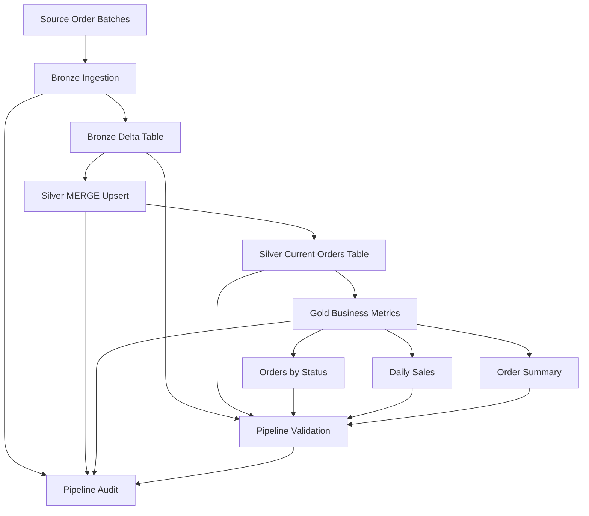

# Architecture Documentation

# Orchestrated Incremental Orders Pipeline with Databricks Workflows

## 1. Purpose

This document describes the technical architecture of the **Orchestrated Incremental Orders Pipeline with Databricks Workflows**.

The project implements an incremental data pipeline for simulated e-commerce order events using:

* Databricks Workflows
* Apache Spark
* PySpark
* Spark SQL
* Delta Lake
* Delta Lake `MERGE INTO`
* Medallion-style data architecture
* Audit logging
* Automated validation

The pipeline is designed to demonstrate how batch-based incremental data can be processed, curated, validated, and orchestrated in Databricks.

---

## 2. Architectural Scope

The scope of this project includes:

* Synthetic source batch creation
* Bronze ingestion of raw order events
* Silver current-state modeling using Delta Lake `MERGE INTO`
* Gold business metric generation
* Databricks Workflow orchestration
* Parameterized notebook execution
* Pipeline-level audit logging
* Final validation checks

The project does not include external production data sources, dashboards, alerting, or CI/CD deployment.

---

## 3. High-Level Architecture



---

## 4. Data Flow

The pipeline processes order events in the following sequence:

```text
Source Batch Tables
        ↓
Bronze Raw Events
        ↓
Silver Current Orders
        ↓
Gold Business Metrics
        ↓
Pipeline Validation
```

Each source batch is processed incrementally through Bronze and Silver before Gold metrics are generated.

---

## 5. Databricks Workflow Design

The pipeline is orchestrated using a Databricks Workflow named:

```text
orchestrated-incremental-orders-pipeline
```

The workflow executes notebook tasks in a strict dependency chain.

```text
01_create_sample_batches
        ↓
02_bronze_ingestion_batch_1
        ↓
03_silver_merge_upsert_batch_1
        ↓
02_bronze_ingestion_batch_2
        ↓
03_silver_merge_upsert_batch_2
        ↓
02_bronze_ingestion_batch_3
        ↓
03_silver_merge_upsert_batch_3
        ↓
04_gold_business_metrics
        ↓
05_pipeline_validation
```

This structure ensures that each batch is ingested into Bronze before it is applied to the Silver current-state table.

---

## 6. Workflow Parameters

The workflow uses a global parameter:

```text
pipeline_run_id = {{job.run_id}}
```

This parameter is passed to all notebooks and used for audit logging and validation tracking.

The Bronze and Silver notebooks also receive:

```text
batch_id
```

This allows the same notebook to process multiple batches.

Example:

| Task                             | batch_id |
| -------------------------------- | -------: |
| `02_bronze_ingestion_batch_1`    |        1 |
| `02_bronze_ingestion_batch_2`    |        2 |
| `02_bronze_ingestion_batch_3`    |        3 |
| `03_silver_merge_upsert_batch_1` |        1 |
| `03_silver_merge_upsert_batch_2` |        2 |
| `03_silver_merge_upsert_batch_3` |        3 |

---

## 7. Project Schema

All tables are created inside the following schema:

```text
orders_workflow_project
```

This isolates the project assets from other Databricks objects.

---

## 8. Source Layer

### Source Tables

```text
orders_workflow_project.source_orders_batch_1
orders_workflow_project.source_orders_batch_2
orders_workflow_project.source_orders_batch_3
```

The source layer simulates order events from an e-commerce system.

Each record represents a point-in-time event for an order.

| Column          | Description                       |
| --------------- | --------------------------------- |
| `batch_id`      | Source batch identifier           |
| `order_id`      | Unique order identifier           |
| `customer_id`   | Customer identifier               |
| `order_status`  | Order status in the source event  |
| `order_amount`  | Order amount in USD               |
| `event_ts`      | Timestamp when the event occurred |
| `source_system` | Source system name                |

---

## 9. Bronze Layer

### Table

```text
orders_workflow_project.bronze_orders_raw
```

### Purpose

The Bronze layer stores all incoming order events from the source batches.

It preserves the complete historical event log and uses append-based ingestion.

### Responsibilities

* Read one source batch at a time.
* Add ingestion metadata.
* Append records to the Bronze Delta table.
* Preserve all order status changes.
* Avoid duplicate ingestion of the same batch.

### Key Metadata

| Column                | Description                                        |
| --------------------- | -------------------------------------------------- |
| `bronze_ingestion_ts` | Timestamp when the record was ingested into Bronze |
| `source_batch_table`  | Source table used for the ingestion                |

### Write Pattern

```python
bronze_df.write \
    .format("delta") \
    .mode("append") \
    .saveAsTable("orders_workflow_project.bronze_orders_raw")
```

Bronze is append-based because it represents historical raw events.

---

## 10. Silver Layer

### Table

```text
orders_workflow_project.silver_orders_current
```

### Purpose

The Silver layer maintains the latest known state of each order.

Unlike Bronze, Silver stores only one row per `order_id`.

### Responsibilities

* Read one Bronze batch at a time.
* Deduplicate records within the batch.
* Select the latest event per order using `event_ts`.
* Update existing orders when newer events arrive.
* Insert new orders when they do not exist.
* Prevent older events from overwriting newer records.

---

## 11. Silver Deduplication

Before applying `MERGE INTO`, the incoming batch is deduplicated by `order_id`.

```python
dedup_window = Window.partitionBy("order_id").orderBy(col("event_ts").desc())
```

This ensures that if multiple events for the same order exist in a single batch, only the latest event is sent to Silver.

---

## 12. Delta Lake MERGE Strategy

Silver uses Delta Lake `MERGE INTO` to maintain the current state.

```sql
MERGE INTO orders_workflow_project.silver_orders_current AS target
USING silver_updates_temp AS source
ON target.order_id = source.order_id

WHEN MATCHED AND source.last_event_ts > target.last_event_ts THEN UPDATE

WHEN NOT MATCHED THEN INSERT
```

### Match Key

```text
order_id
```

### Update Rule

A record is updated only when the incoming event is newer:

```text
source.last_event_ts > target.last_event_ts
```

This prevents late-arriving older events from replacing newer current-state records.

### Insert Rule

If the `order_id` does not exist in Silver, the record is inserted.

---

## 13. Gold Layer

The Gold layer creates business-ready tables from the Silver current-state table.

### Gold Tables

```text
orders_workflow_project.gold_orders_by_status
orders_workflow_project.gold_daily_sales
orders_workflow_project.gold_order_summary
```

---

## 14. Gold Table: Orders by Status

### Table

```text
orders_workflow_project.gold_orders_by_status
```

### Purpose

Provides an aggregated view of current orders by status.

### Metrics

| Metric                 | Description                                  |
| ---------------------- | -------------------------------------------- |
| `total_orders`         | Number of orders by status                   |
| `total_amount_usd`     | Total order amount by status                 |
| `avg_order_amount_usd` | Average order amount by status               |
| `first_event_ts`       | Earliest event timestamp in the status group |
| `latest_event_ts`      | Latest event timestamp in the status group   |

---

## 15. Gold Table: Daily Sales

### Table

```text
orders_workflow_project.gold_daily_sales
```

### Purpose

Provides current-order metrics grouped by latest order activity date.

### Metrics

| Metric                           | Description                                    |
| -------------------------------- | ---------------------------------------------- |
| `total_current_orders`           | Number of current orders for the activity date |
| `gross_current_order_amount_usd` | Gross order amount                             |
| `recognized_revenue_usd`         | Revenue from delivered orders                  |
| `cancelled_amount_usd`           | Amount associated with cancelled orders        |
| `pending_orders`                 | Number of pending orders                       |
| `shipped_orders`                 | Number of shipped orders                       |
| `delivered_orders`               | Number of delivered orders                     |
| `cancelled_orders`               | Number of cancelled orders                     |

---

## 16. Gold Table: Order Summary

### Table

```text
orders_workflow_project.gold_order_summary
```

### Purpose

Provides a one-row executive summary of the current order state.

### Metrics

| Metric                           | Description                    |
| -------------------------------- | ------------------------------ |
| `total_current_orders`           | Total number of current orders |
| `total_customers`                | Number of unique customers     |
| `gross_current_order_amount_usd` | Gross current order amount     |
| `recognized_revenue_usd`         | Revenue from delivered orders  |
| `active_order_amount_usd`        | Value of non-cancelled orders  |
| `cancelled_amount_usd`           | Value of cancelled orders      |
| `avg_order_value_usd`            | Average order value            |
| `delivered_rate_pct`             | Percentage of delivered orders |
| `cancellation_rate_pct`          | Percentage of cancelled orders |

---

## 17. Audit Logging

### Table

```text
orders_workflow_project.pipeline_run_audit
```

The audit table records execution metadata for each workflow task.

| Column              | Description                 |
| ------------------- | --------------------------- |
| `pipeline_run_id`   | Workflow run identifier     |
| `task_name`         | Executed task name          |
| `status`            | Task execution status       |
| `records_processed` | Number of records processed |
| `message`           | Execution message           |
| `processed_ts`      | Processing timestamp        |

Audit logging provides traceability across the workflow execution.

---

## 18. Validation Layer

### Table

```text
orders_workflow_project.pipeline_validation_results
```

The validation layer verifies the final pipeline state.

### Validation Categories

* Table existence checks
* Record count checks
* Silver final-state checks
* Audit task checks
* Workflow completion checks

If any validation fails, the notebook raises an exception and the workflow run fails.

---

## 19. Expected Table Counts

| Table                   | Expected Records |
| ----------------------- | ---------------: |
| `source_orders_batch_1` |                3 |
| `source_orders_batch_2` |                3 |
| `source_orders_batch_3` |                4 |
| `bronze_orders_raw`     |               10 |
| `silver_orders_current` |                5 |
| `gold_orders_by_status` |                4 |
| `gold_daily_sales`      |                2 |
| `gold_order_summary`    |                1 |

---

## 20. Expected Silver Final State

| order_id | Final Status |
| -------- | ------------ |
| `1001`   | `delivered`  |
| `1002`   | `cancelled`  |
| `1003`   | `shipped`    |
| `1004`   | `delivered`  |
| `1005`   | `pending`    |

---

## 21. Operational Behavior

The workflow is designed with the following operational characteristics:

| Characteristic            | Implementation                                        |
| ------------------------- | ----------------------------------------------------- |
| Orchestration             | Databricks Workflows                                  |
| Parameterization          | `pipeline_run_id`, `batch_id`                         |
| Incremental processing    | Batch-by-batch Bronze and Silver execution            |
| Current-state maintenance | Delta Lake `MERGE INTO`                               |
| Auditability              | `pipeline_run_audit`                                  |
| Validation                | `pipeline_validation_results`                         |
| Failure control           | Validation notebook raises exception on failed checks |

---

## 22. Screenshots

### Workflow Task List


### Workflow Timeline


### Workflow Graph


### Table Counts


### Validation Results


### Pipeline Audit


---

## 23. Current Limitations

This project is a controlled orchestration and data engineering demonstration.

Current limitations:

* Source data is synthetic.
* Workflow execution is manually triggered.
* No external production data source is connected.
* No alerting mechanism is configured.
* No dashboard layer is included.
* No CI/CD process is implemented for workflow deployment.
* No advanced batch control table is implemented.

---

## 24. Future Enhancements

Potential improvements include:

* Scheduled workflow execution.
* Failure notifications.
* Databricks SQL dashboard layer.
* Control table for batch lifecycle management.
* Bad record quarantine handling.
* Late-arriving event audit table.
* Schema evolution handling.
* Workflow configuration deployment through CI/CD.
* Integration with external storage or APIs.
* Data quality framework integration.

---

## 25. Summary

This architecture demonstrates an orchestrated incremental data pipeline in Databricks.

The solution processes source batches through Bronze, Silver, and Gold layers, maintains a current-state table with Delta Lake `MERGE INTO`, records execution metadata through audit logging, and validates the final state of the pipeline through automated validation checks.

The workflow successfully connects notebook-based development with production-style orchestration patterns.

